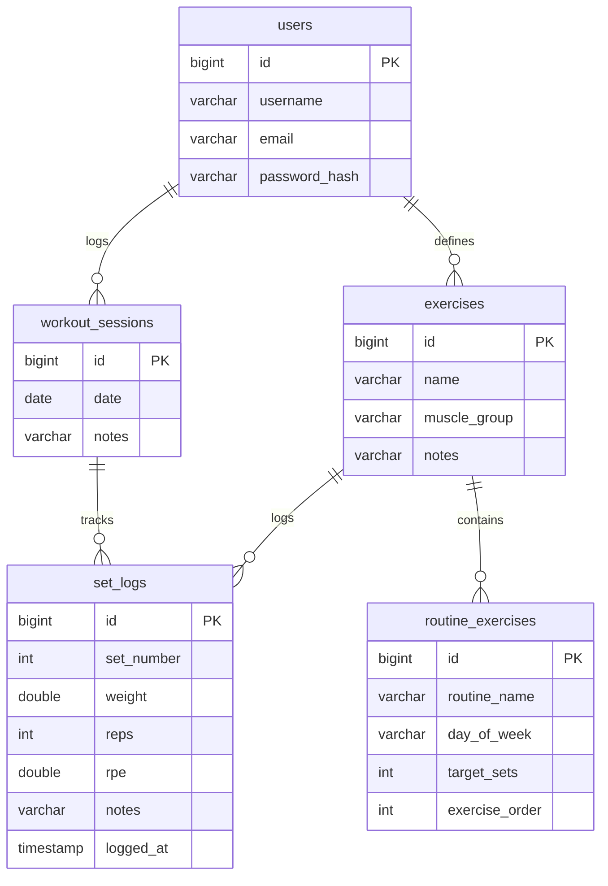

# Overload 🏋️‍♂️

Overload is a modern, lightweight, self-hosted gym workout tracker designed for tracking lifts and maximizing progressive overload. Built with a focus on robust software engineering practices, clean architecture, and zero-framework frontend simplicity.

---

## ✨ Features

- **Routine templates & Workout sessions**: Clean split between routine planning (templates) and actual workout logging.
- **Dynamic Session Logging**: Add or remove sets dynamically during active sessions.
- **Performance Auto-Fill**: Automatically pre-populates your targets based on your most recent performance for that exercise.
- **Stateless Authentication**: Fully secured with JWT (JSON Web Tokens) and Google OAuth2 integration.
- **Performance Analytics**: Interactive history logs, streak calculation, and PR (Personal Record) tracking.
- **Core Calculators**: Estimated 1-Rep Max (1RM) coaching calculated dynamically using the Epley formula directly in database queries (<2ms latency).

---

## 🛠️ Tech Stack

- **Backend**: Java 21, Spring Boot 3.3, Spring Security, Spring Data JPA
- **Database**: PostgreSQL 16 (configured with volume persistence)
- **Containerization**: Docker & Docker Compose
- **Frontend**: Plain HTML5, Vanilla CSS3 (Custom styling system with dark/light themes), Vanilla JavaScript (Modular ES6 wrappers)
- **Build Tool**: Maven

---

## 📦 Project Structure

```text
Overload/
├── src/
│   ├── main/
│   │   ├── java/com/lohith/gymtracker/
│   │   │   ├── config/       # Core application configurations
│   │   │   ├── controller/   # REST Controllers (thin API layer)
│   │   │   ├── dto/          # Data Transfer Objects
│   │   │   ├── exception/    # Custom exceptions & global handler
│   │   │   ├── model/        # JPA Entities (DB mapping)
│   │   │   ├── repository/   # Spring Data JPA repositories
│   │   │   └── security/     # JWT authentication, filters & security config
│   │   │   └── service/      # Business logic (PR detection, volume, etc.)
│   │   └── resources/
│   │       ├── application.properties
│   │       └── static/       # Frontend UI (HTML, CSS, JS)
│   └── test/                 # Test packages
├── Dockerfile                # Multi-stage production build config
├── docker-compose.yml        # Orchestration configuration
├── dev.sh                    # Hot-reloading development runner
└── pom.xml                   # Maven dependencies
```

---

## 💾 Database Schema

The database consists of 5 core tables mapping the workout logging domain:



---

## 🚀 Getting Started

### Prerequisites

Make sure you have [Docker](https://www.docker.com/) and [Docker Compose](https://docs.docker.com/compose/) installed on your machine.

### Quick Start

1. Clone this repository:
   ```bash
   git clone https://github.com/Pyro0707/Overload.git
   cd Overload
   ```

2. Copy the environment template:
   ```bash
   cp .env.example .env
   ```

3. Launch the stack:
   ```bash
   docker compose up --build -d
   ```

The backend server and PostgreSQL database will spin up automatically. Once initialized, access the frontend at:
👉 **[http://localhost:8080](http://localhost:8080)**

---

## 💻 Development Mode

To run locally with hot-reloading enabled for static resource development:

```bash
chmod +x ./dev.sh
./dev.sh
```
This starts the application locally using Maven, serving frontend files dynamically from your local directory so changes reflect instantly without rebuilding.
